<div align="center">


# Dafeiyu-Go

**把 DeepSeek Harness 放进 Windows 托盘。**

一键启动 · 余额与用量 · 插件与技能 · 更新与备份

[**在线交互预览**](https://yunxiramito.github.io/Dafeiyu-Go/) · [**下载安装器**](https://github.com/YunxiRamito/Dafeiyu-Go-DeepSeek-Harness-Setup/releases/latest) · [**下载启动器 ZIP**](https://github.com/YunxiRamito/Dafeiyu-Go-DeepSeek-Harness-Click-To-Run/releases/latest) · [更新日志](CHANGELOG.md)

<sub>A Windows tray launcher and manager for DeepSeek Harness.</sub>

<br>

[](https://github.com/YunxiRamito/Dafeiyu-Go-DeepSeek-Harness-Click-To-Run/releases/latest)
[](https://github.com/YunxiRamito/Dafeiyu-Go-DeepSeek-Harness-Setup/releases/latest)


[](LICENSE)

<br>

<a href="https://yunxiramito.github.io/Dafeiyu-Go/"><picture><source media="(prefers-color-scheme: dark)" srcset="docs/readme/btn-preview-dark.png"></picture></a>&nbsp;&nbsp;<a href="https://github.com/YunxiRamito/Dafeiyu-Go-DeepSeek-Harness-Setup/releases/latest"><picture><source media="(prefers-color-scheme: dark)" srcset="docs/readme/btn-download-dark.png"></picture></a>

<sub>[启动器 ZIP](https://github.com/YunxiRamito/Dafeiyu-Go-DeepSeek-Harness-Click-To-Run/releases/latest) · [Gitee 镜像](https://gitee.com/Yunxiramito/Dafeiyu-Go-DeepSeek-Harness-Setup/releases) · [配套安装器](https://github.com/YunxiRamito/Dafeiyu-Go-DeepSeek-Harness-Setup) · [更新日志](CHANGELOG.md)</sub>

<br>

<picture>
  <source media="(prefers-color-scheme: dark)" srcset="docs/readme/hero-dark.webp">
  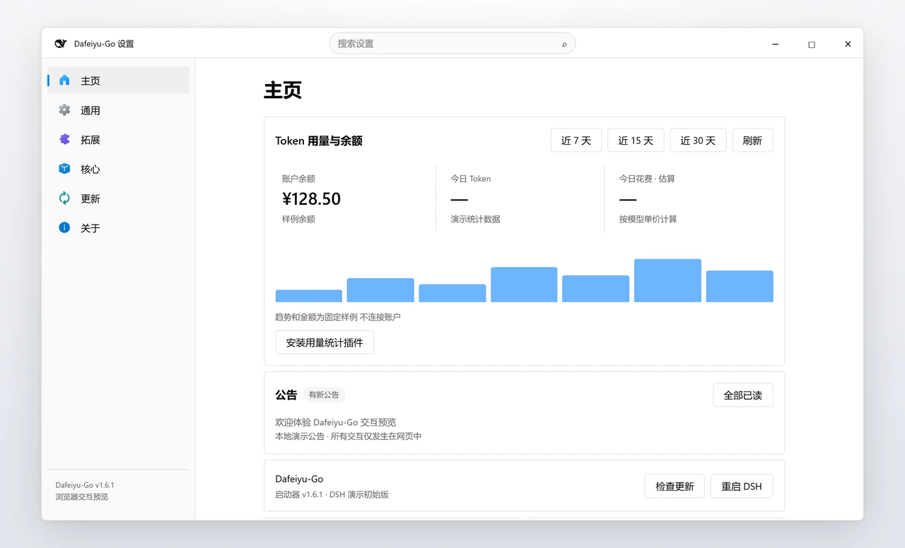
</picture>

<sub>画面来自[在线交互预览](https://yunxiramito.github.io/Dafeiyu-Go/)，余额、图表与公告均为样例数据。</sub>

</div>

<br>

**1.6.0 已发布（2026-10-07）**：设置界面重新分组为六项并支持顶部搜索；插件可粘贴 GitHub 仓库链接安装；技能与插件说明可翻译成中文；安装器与启动器各自独立更新。官方包未签名，见 [签名说明](SIGNING.md)。

**1.7.0 收尾中（未发布）**：信息窗口、公告与通知、Markdown 编辑器、在线人数/服务器监控和页面/资源补丁正在验收。下文预览可能包含这些开发中内容，当前下载仍是正式 1.6.0。

## 在线体验

不用安装，在浏览器里把整套流程走一遍：

<table>
<tr>
<td width="50%" valign="top">

**[打开交互预览 →](https://yunxiramito.github.io/Dafeiyu-Go/)**

- 模拟安装器六步向导
- 虚拟任务栏、托盘右键菜单
- 检查更新、重启与信息窗口
- 设置窗口全部分组、亮暗主题

桌面「启动器预览」可以跳过安装，直接打开设置。

</td>
<td width="50%" valign="top">

**它不会做什么**

- 不安装软件、不改系统、不发网络请求
- 插件、技能、余额与版本都是固定样例
- 不要输入真实 API Key
- 只有点「立即下载」才会打开 GitHub 发布页

预览跟随开发中的版本，个别界面可能比当前 Release 更新。

</td>
</tr>
</table>

## 看一眼

<p align="center">
  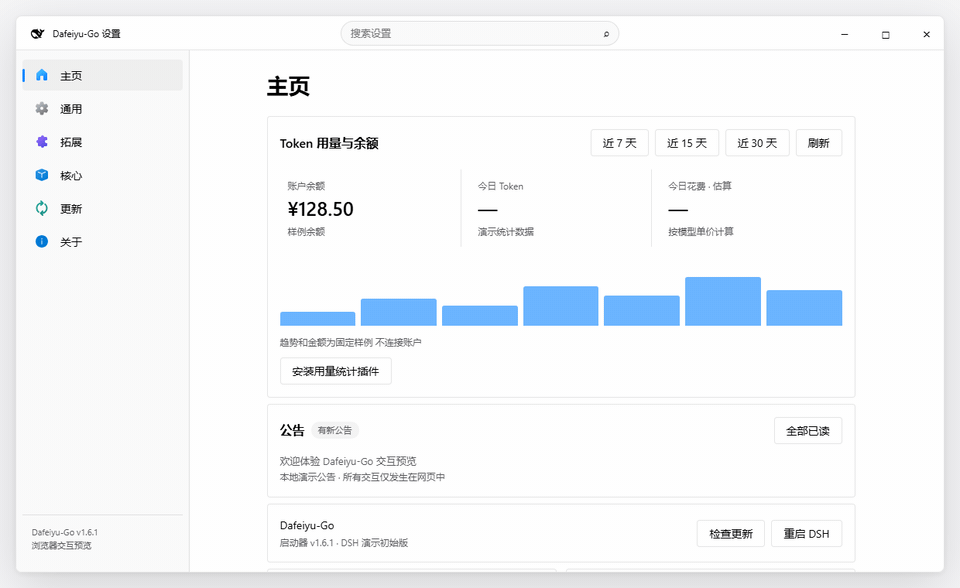
  <br><sub>六个分组：主页 / 通用 / 拓展 / 核心 / 更新 / 关于，组内用页签切换。</sub>
</p>

<table>
<tr>
<td width="50%" align="center" valign="top">
  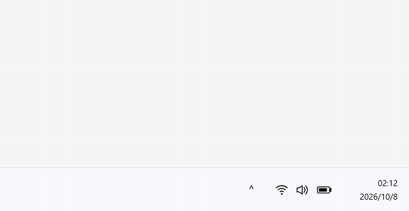
  <br><sub>启动后检查更新，完成后拉起 DSH 服务</sub>
</td>
<td width="50%" align="center" valign="top">
  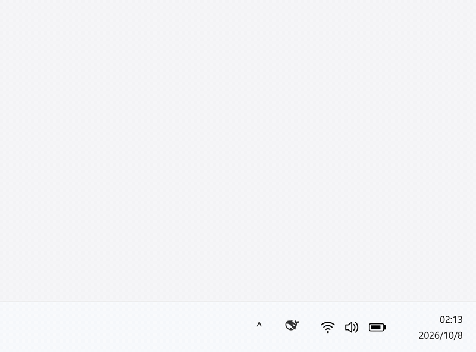
  <br><sub>托盘右键菜单：余额、打开页面、重启、检查更新、设置</sub>
</td>
</tr>
<tr>
<td width="50%" align="center" valign="top">
  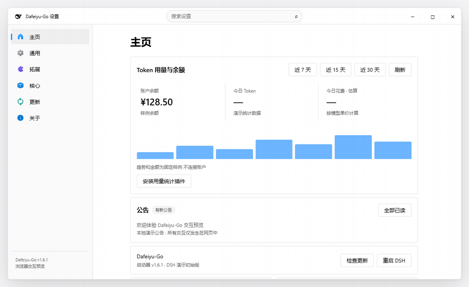
  <br><sub>顶部搜索：标题和描述都能搜，跨页定位</sub>
</td>
<td width="50%" align="center" valign="top">
  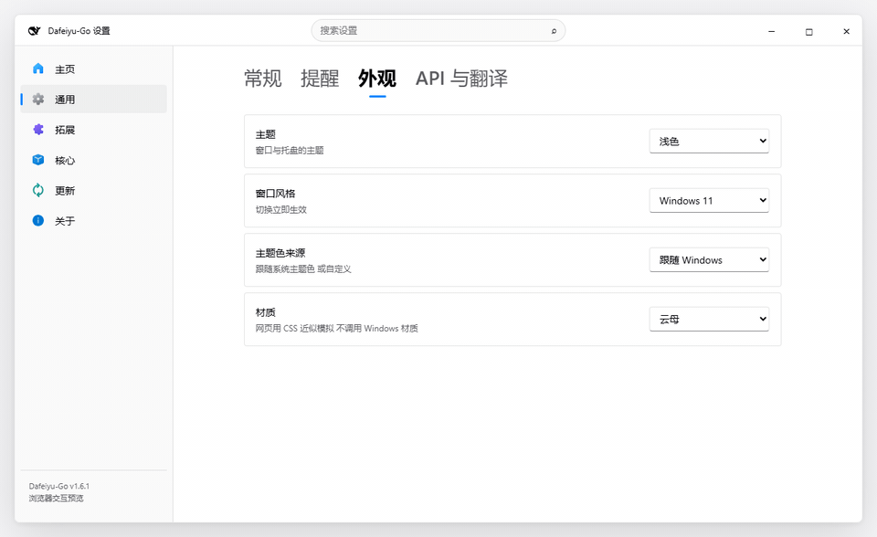
  <br><sub>浅色 / 深色 / 跟随系统，Win10 直角或 Win11 圆角</sub>
</td>
</tr>
</table>

<sub>动图录制自在线交互预览，数据为样例。信息窗口里的服务启动 / 重启状态与「更新 → 补丁」属于开发中的 1.7.0（未发布）。</sub>

## 功能导览

点开每个分组查看界面与要点。截图会跟随 GitHub 的亮 / 暗主题。

<details>
<summary><strong>主页</strong>：余额、用量与公告</summary>
<br>
<picture>
  <source media="(prefers-color-scheme: dark)" srcset="docs/readme/tour-home-dark.webp">
  
</picture>

- 查询账户余额，设置余额与消费告警。
- 安装内置统计插件后，查看近 7 / 15 / 30 天 Token 用量与花费估算，悬停看明细。
- 花费按模型单价估算；余额变化是观测差额，不是完整账单。
- 公告集中显示，可一键全部已读；开发中的 1.7.0 将公告和通知接入 Markdown 信息窗口，按钮动作仅在点击并确认后执行。

</details>

<details>
<summary><strong>通用</strong>：常规、提醒、外观、API 与翻译</summary>
<br>
<picture>
  <source media="(prefers-color-scheme: dark)" srcset="docs/readme/tour-general-dark.webp">
  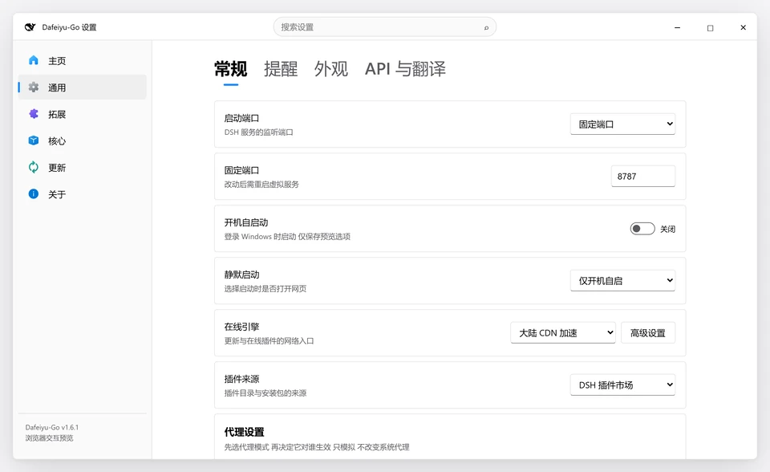
</picture>

- 端口：随机、固定或默认；登录自启与静默启动。
- 下载源与镜像测速；代理分别作用于启动器（默认开启）与 DSH 服务（默认关闭）。
- 导出 / 导入 `.dym` 配置、技能与插件备份。
- 外观：浅色 / 深色 / 跟随系统，Win10 / Win11 风格，主题色与材质。
- 余额查询用的 API Key 以当前 Windows 用户的 DPAPI 加密保存。

</details>

<details>
<summary><strong>拓展</strong>：插件与技能</summary>
<br>
<picture>
  <source media="(prefers-color-scheme: dark)" srcset="docs/readme/tour-plugins-dark.webp">
  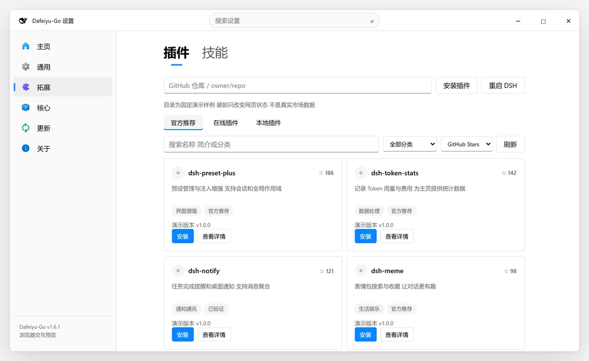
</picture>

- 官方推荐、在线目录与本地插件；搜索、分类、排序。
- 粘贴 GitHub 仓库链接即可安装插件，优先走 DSH 官方 `dsh plugin` 入口。
- 插件支持自检与一键修复。
- 技能按仓库组成技能集，多选安装 / 卸载。
- 详情页「翻译成中文」：只翻自然语言，代码与 Markdown 结构保持原样；复用已配置的 Key，点按钮才联网。

</details>

<details>
<summary><strong>核心</strong>：服务与组件</summary>
<br>
<picture>
  <source media="(prefers-color-scheme: dark)" srcset="docs/readme/tour-service-dark.webp">
  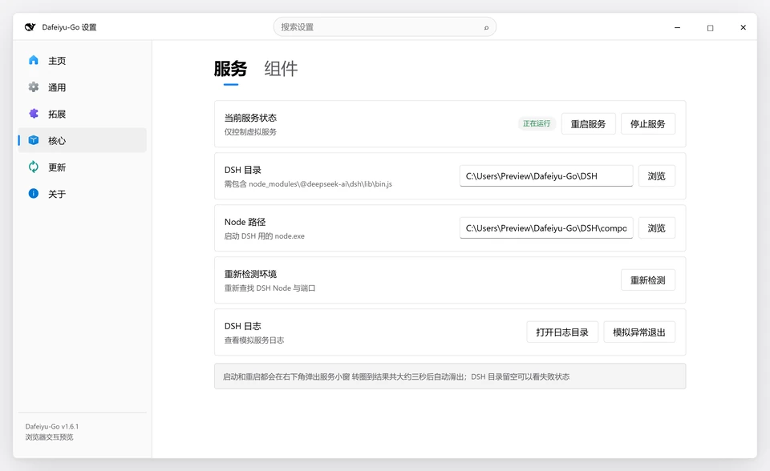
</picture>

- 查看服务状态，启动、重启或停止 DSH。
- 指定 DSH 目录与 Node 路径，一键重新检测环境。
- 查看 DSH 日志。
- 组件页检测 .NET 8 桌面运行时、Windows App Runtime 1.8、Node.js 等，缺什么补什么。

</details>

<details>
<summary><strong>更新</strong>：启动器、DSH 与安装器</summary>
<br>
<picture>
  <source media="(prefers-color-scheme: dark)" srcset="docs/readme/tour-updates-dark.webp">
  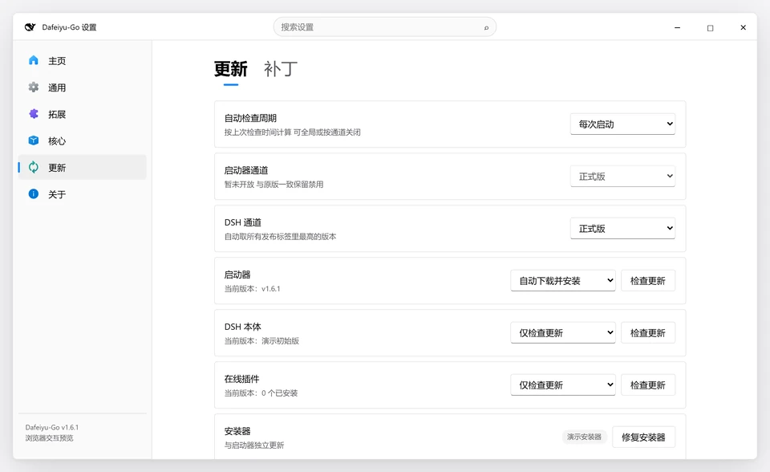
</picture>

- 自动检查周期：每次启动、三天、七天、一个月或关闭。
- DSH 通道与更新策略：自动下载安装、仅检查或关闭。
- 安装器与启动器各自比对版本，互不阻塞；可在这里「修复安装器」。
- 进度、速度与历史在侧栏左下角的「下载任务」里，可暂停 / 继续 / 重试 / 取消。
- 「补丁」子页属于开发中的 1.7.0，尚未发布；仅页面和资源补丁可应用，脚本和程序文件补丁即使确认也拒绝安装。

</details>

<details>
<summary><strong>关于</strong>：版本、健康检查与诊断</summary>
<br>
<picture>
  <source media="(prefers-color-scheme: dark)" srcset="docs/readme/tour-about-dark.webp">
  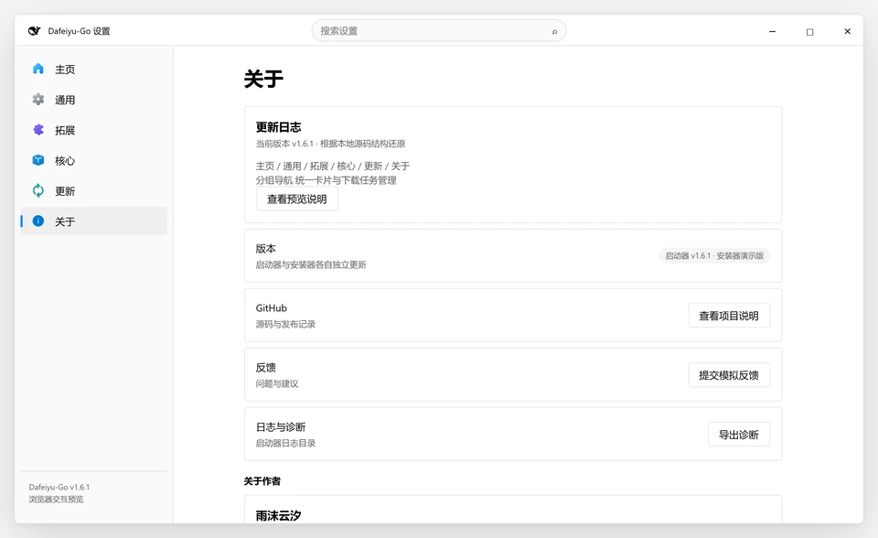
</picture>

- 当前版本与更新日志。
- 健康检查：DSH、Node 与端口状态。
- 预览并导出诊断报告，不含原始日志或配置。
- 反馈入口与项目链接。

</details>

## 它们如何配合

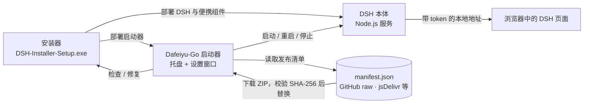

| | 安装器 | 启动器 ZIP |
| :--- | :--- | :--- |
| **适合** | 首次部署 | 已有 DSH，只换启动器 |
| **DSH 本体** | 下载并部署 | 不包含，需要已安装 |
| **Node / pnpm / Git / Python** | 缺失时下载便携版 | 使用已有环境 |
| **运行库** | 引导程序补齐 .NET 8 与 Windows App Runtime 1.8 | 引导程序按需提示补齐 |
| **快捷方式与自启** | 向导中选择 | 在设置「通用」里开启自启 |
| **入口** | [安装器 Releases](https://github.com/YunxiRamito/Dafeiyu-Go-DeepSeek-Harness-Setup/releases/latest) | [启动器 Releases](https://github.com/YunxiRamito/Dafeiyu-Go-DeepSeek-Harness-Click-To-Run/releases/latest) |

启动器管理的是本机 [DeepSeek Harness](https://github.com/deepseek-ai/deepseek-harness) 服务；首次部署推荐使用安装器，已有 DSH 可以直接用 ZIP。

## 三步开始

1. **下载**：[安装器最新版](https://github.com/YunxiRamito/Dafeiyu-Go-DeepSeek-Harness-Setup/releases/latest)负责部署环境与启动器；手动安装则下载 [启动器最新版](https://github.com/YunxiRamito/Dafeiyu-Go-DeepSeek-Harness-Click-To-Run/releases/latest)的 `DeepSeekHarness-<版本>.zip`。
2. **安装 / 解压**：按安装器向导操作，或将 ZIP **完整解压**到 `<DSH 根目录>\DeepSeek Harness\`，保留所有依赖文件。
3. **启动**：双击 `DeepSeek Harness.exe`，同意 UAC。服务就绪后打开网页；右键托盘图标进入菜单与设置。

<details>
<summary>手动安装的目录与路径配置</summary>

```text
<DSH 根目录>\
├─ node_modules\@deepseek-ai\dsh\lib\bin.js
├─ logs\
└─ DeepSeek Harness\
   ├─ DeepSeek Harness.exe
   ├─ DeepSeek Harness.Core.exe
   └─ …其余 ZIP 文件
```

DSH 根目录依次从 `DSH_ROOT`、程序同目录的 `launcher.json`、已记录路径、程序目录及上级目录、常见位置查找。Node.js 可用 `DSH_NODE` 或 `nodePath` 指定，也会查找 DSH 内的 Node、PATH 和常见安装位置。

需要指定路径时，在启动器同目录创建 `launcher.json`：

```json
{
  "dshRoot": "D:\\DSH",
  "nodePath": "C:\\Program Files\\nodejs\\node.exe"
}
```

</details>

## 运行要求与权限

| 项目 | 要求 |
| :--- | :--- |
| **系统** | Windows 10 1809（build 17763）及以上 / Windows 11，**x64** |
| **运行库** | .NET 8 **桌面运行时** + Windows App Runtime **1.8** |
| **服务环境** | 可运行的 DSH 本体与兼容的 Node.js；仅解压启动器不会安装 DSH |
| **权限** | 引导程序要求管理员权限，启动的 DSH 服务继承该权限 |

登录自启通过最高权限计划任务 `DeepSeekHarnessAutostart` 实现，使用 `--no-browser`，只驻留托盘。

**密钥与网络**：启动器保存的余额查询 API Key 使用当前 Windows 用户的 DPAPI 加密；这不代表 DSH 的其他凭据文件也已加密。余额查询连接 DeepSeek API，更新、在线目录及下载会连接相应服务；选择加速源时部分下载会经过第三方镜像。代理设置可分别控制是否作用于启动器（默认开启）与 DSH 服务（默认关闭）；改完 DSH 那一项要重启服务才生效。不要公开 API Key、带 token 的网页地址或未经脱敏的日志与备份。

## 遇到问题

| 现象 | 处理 |
| :--- | :--- |
| **双击无法启动** | 确认已同意 UAC，并按引导补齐运行库；查看 `%LOCALAPPDATA%\DeepSeekHarness\launcher.log` |
| **找不到 DSH / Node.js** | 确认 DSH 已安装，按上方示例填写 `launcher.json` |
| **网页提示需要认证** | 稍等后再点「打开页面」，或重启服务；地址来自 `<DSH 根目录>\logs\last-url.txt`，需要保留完整 token，不要只打开裸端口 |
| **更换目录后仍用旧路径** | 修改 `launcher.json`；必要时移除 `%LOCALAPPDATA%\DeepSeekHarness\launcher-path.txt` 后重启 |
| **用量卡片没有记录** | 先安装内置统计插件，再产生一次模型调用；图中的花费是价格表估算，余额变化另作参考 |
| **SmartScreen 提示** | 当前构建未签名；核对官方发布来源及清单中的 SHA-256 后，再决定是否继续运行，见 [签名说明](SIGNING.md) |

<details>
<summary>命令行与源码构建</summary>

### 静默启动

`--no-browser`、`--silent`、`--tray`、`--startup` 均可启动服务并驻留托盘，不自动打开浏览器：

```powershell
& '.\DeepSeek Harness.exe' --no-browser
```

### 构建与检查

需要 Windows、.NET 8 SDK，以及 Windows 自带的 .NET Framework C# 编译器。WinUI 依赖通过 NuGet 还原。

在仓库根目录执行：

```powershell
# 编译主程序与引导程序、打包 ZIP；不改发布清单
.\release.ps1 -NoManifest

# 静态检查产物，不启动 GUI
.\verify.ps1
```

`release.ps1` 优先使用本机便携 SDK，否则查找 `dotnet`；不带 `-NoManifest` 会更新 `manifest.json`，应在对应发布资产就绪后再更新清单。`source/build-winui.ps1` 含本机 SDK 与代理路径，其他机器使用前需检查这些设置。

发布背景见 [发布指南](RELEASE.md)，当前工作交接见 [HANDOVER.md](HANDOVER.md)。历史版本示例不应直接当作当前发布命令。

</details>

<details>
<summary>English quick start</summary>

**Dafeiyu-Go is a Windows tray launcher and manager for DeepSeek Harness.** It handles service startup, balance and usage views, plugins, skills, updates and `.dym` backups. Try it first in the [interactive web preview](https://yunxiramito.github.io/Dafeiyu-Go/); everything there is simulated and the images above use sample data.

1. Download the [Setup release](https://github.com/YunxiRamito/Dafeiyu-Go-DeepSeek-Harness-Setup/releases/latest) for a fresh installation, or the [launcher ZIP](https://github.com/YunxiRamito/Dafeiyu-Go-DeepSeek-Harness-Click-To-Run/releases/latest) for an existing DSH installation.
2. Extract the entire ZIP into `<DSH root>\DeepSeek Harness\`.
3. Run `DeepSeek Harness.exe` and accept UAC; right-click the tray icon for controls and settings.

Requires **Windows 10 1809+ / Windows 11 x64**, **.NET 8 Desktop Runtime**, **Windows App Runtime 1.8**, a working DSH installation and compatible Node.js. DSH inherits administrator privileges. Login startup uses an elevated scheduled task; `--no-browser` starts without opening a browser.

Balance-query keys saved by the launcher use current-user DPAPI. Online features contact DeepSeek, GitHub, package registries and configured download mirrors. Builds are currently unsigned. Keep API keys, authenticated URLs, logs and backups private.

</details>

## 相关项目

| | |
| :--- | :--- |
| [**Dafeiyu-Go Setup**](https://github.com/YunxiRamito/Dafeiyu-Go-DeepSeek-Harness-Setup) | 配套 Windows 安装器与卸载器，首次部署从这里开始 |
| [**在线交互预览**](https://yunxiramito.github.io/Dafeiyu-Go/) | 浏览器里体验安装、更新与全部设置分组，全程模拟 |
| [**DeepSeek Harness**](https://github.com/deepseek-ai/deepseek-harness) | 启动器所管理的本机服务 |

---

**兼容命名**：产品名为 Dafeiyu-Go；可执行文件、数据目录及升级协议继续使用旧名称，见 [迁移说明](TRANSITION.md)。

[MIT License](LICENSE) · [第三方声明](THIRD-PARTY-NOTICES.md) · [DeepSeek Harness](https://github.com/deepseek-ai/deepseek-harness)
