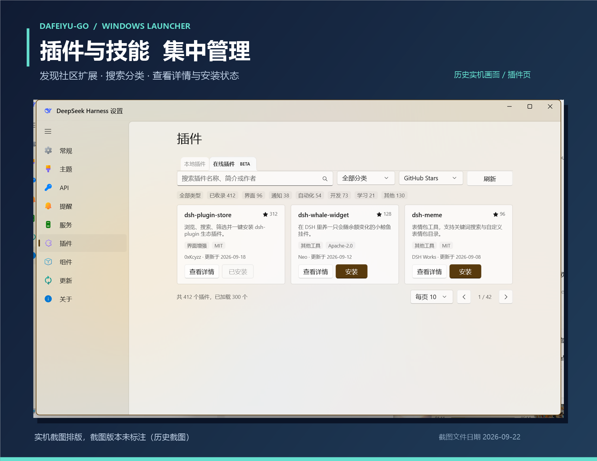

<div align="center">

# 大肥鱼Go · Dafeiyu-Go

**把 DeepSeek Harness 放进 Windows 托盘。**

一键启动 · 余额与用量 · 插件与技能 · 更新与备份

[**在线交互预览**](https://yunxiramito.github.io/Dafeiyu-Go/) · [**下载安装器**](https://github.com/YunxiRamito/Dafeiyu-Go-DeepSeek-Harness-Setup/releases/latest) · [**下载启动器 ZIP**](https://github.com/YunxiRamito/Dafeiyu-Go-DeepSeek-Harness-Click-To-Run/releases/latest) · [更新日志](CHANGELOG.md)

Windows 10 / 11 · x64 · WinUI 3

**1.5.4 已发布**：余额 / Token 图表改进、下载中心、启动器与 DSH 服务独立代理范围。官方包未签名；两仓 CI、npm / 镜像与公开清单已核验，验证范围见 [交接](HANDOVER.md)。

</div>



<p align="center"><sub>实机截图排版，截图版本未标注（历史截图）；截图文件日期 2026-09-22，不代表当前版本界面。</sub></p>

## 一个入口，管好本机 DSH

| 功能 | 能做什么 |
| :--- | :--- |
| **启动与托盘** | 自动定位 DSH 与 Node.js，打开页面、重启服务、设置登录自启 |
| **余额与用量** | 查询账户余额、设置告警；安装内置统计插件后查看近 7 / 15 / 30 天用量与花费估算 |
| **插件与技能** | 浏览推荐与在线目录，管理本地项目；插件支持自检与修复 |
| **更新与备份** | 管理启动器与 DSH 更新通道，导出 / 导入 `.dym` 配置、技能与插件备份 |
| **下载任务** | 侧栏左下角入口，实时进度与速度，可暂停 / 继续 / 重试 / 取消，历史记录保存在本机 |
| **健康检查** | 在「关于」页检查 DSH、Node 与端口状态，预览并导出不含原始日志或配置的诊断报告 |

启动器管理的是本机 [DeepSeek Harness](https://github.com/deepseek-ai/deepseek-harness) 服务；首次部署推荐使用安装器，已有 DSH 可以直接用 ZIP。

## 三步开始

1. **下载**：[安装器最新版](https://github.com/YunxiRamito/Dafeiyu-Go-DeepSeek-Harness-Setup/releases/latest)负责部署环境与启动器；手动安装则下载 [启动器最新版](https://github.com/YunxiRamito/Dafeiyu-Go-DeepSeek-Harness-Click-To-Run/releases/latest)的 `DeepSeekHarness-<版本>.zip`。
2. **安装 / 解压**：按安装器向导操作，或将 ZIP **完整解压**到 `<DSH 根目录>\DeepSeek Harness\`，保留所有依赖文件。
3. **启动**：双击 `DeepSeek Harness.exe`，同意 UAC。服务就绪后打开网页；右键托盘图标进入菜单与设置。

<details>
<summary>手动安装的目录与路径配置</summary>

```text
<DSH 根目录>\
├─ node_modules\@deepseek-ai\dsh\lib\bin.js
├─ logs\
└─ DeepSeek Harness\
   ├─ DeepSeek Harness.exe
   ├─ DeepSeek Harness.Core.exe
   └─ …其余 ZIP 文件
```

DSH 根目录依次从 `DSH_ROOT`、程序同目录的 `launcher.json`、已记录路径、程序目录及上级目录、常见位置查找。Node.js 可用 `DSH_NODE` 或 `nodePath` 指定，也会查找 DSH 内的 Node、PATH 和常见安装位置。

需要指定路径时，在启动器同目录创建 `launcher.json`：

```json
{
  "dshRoot": "D:\\DSH",
  "nodePath": "C:\\Program Files\\nodejs\\node.exe"
}
```

</details>

## 运行要求与权限

| 项目 | 要求 |
| :--- | :--- |
| **系统** | Windows 10 1809（build 17763）及以上 / Windows 11，**x64** |
| **运行库** | .NET 8 **桌面运行时** + Windows App Runtime **1.8** |
| **服务环境** | 可运行的 DSH 本体与兼容的 Node.js；仅解压启动器不会安装 DSH |
| **权限** | 引导程序要求管理员权限，启动的 DSH 服务继承该权限 |

登录自启通过最高权限计划任务 `DeepSeekHarnessAutostart` 实现，使用 `--no-browser`，只驻留托盘。

**密钥与网络**：启动器保存的余额查询 API Key 使用当前 Windows 用户的 DPAPI 加密；这不代表 DSH 的其他凭据文件也已加密。余额查询连接 DeepSeek API，更新、在线目录及下载会连接相应服务；选择加速源时部分下载会经过第三方镜像。代理设置可分别控制是否作用于启动器（默认开启）与 DSH 服务（默认关闭）；改完 DSH 那一项要重启服务才生效。不要公开 API Key、带 token 的网页地址或未经脱敏的日志与备份。

## 遇到问题

| 现象 | 处理 |
| :--- | :--- |
| **双击无法启动** | 确认已同意 UAC，并按引导补齐运行库；查看 `%LOCALAPPDATA%\DeepSeekHarness\launcher.log` |
| **找不到 DSH / Node.js** | 确认 DSH 已安装，按上方示例填写 `launcher.json` |
| **网页提示需要认证** | 稍等后再点「打开页面」，或重启服务；地址来自 `<DSH 根目录>\logs\last-url.txt`，需要保留完整 token，不要只打开裸端口 |
| **更换目录后仍用旧路径** | 修改 `launcher.json`；必要时移除 `%LOCALAPPDATA%\DeepSeekHarness\launcher-path.txt` 后重启 |
| **用量卡片没有记录** | 先安装内置统计插件，再产生一次模型调用；图中的花费是价格表估算，余额变化另作参考 |
| **SmartScreen 提示** | 当前构建未签名；核对官方发布来源及清单中的 SHA-256 后，再决定是否继续运行，见 [签名说明](SIGNING.md) |

<details>
<summary>命令行与源码构建</summary>

### 静默启动

`--no-browser`、`--silent`、`--tray`、`--startup` 均可启动服务并驻留托盘，不自动打开浏览器：

```powershell
& '.\DeepSeek Harness.exe' --no-browser
```

### 构建与检查

需要 Windows、.NET 8 SDK，以及 Windows 自带的 .NET Framework C# 编译器。WinUI 依赖通过 NuGet 还原。

在仓库根目录执行：

```powershell
# 编译主程序与引导程序、打包 ZIP；不改发布清单
.\release.ps1 -NoManifest

# 静态检查产物，不启动 GUI
.\verify.ps1
```

`release.ps1` 优先使用本机便携 SDK，否则查找 `dotnet`；不带 `-NoManifest` 会更新 `manifest.json`，应在对应发布资产就绪后再更新清单。`source/build-winui.ps1` 含本机 SDK 与代理路径，其他机器使用前需检查这些设置。

发布背景见 [发布指南](RELEASE.md)，当前工作交接见 [HANDOVER.md](HANDOVER.md)。历史版本示例不应直接当作当前发布命令。

</details>

<details>
<summary>English quick start</summary>

**Dafeiyu-Go is a Windows tray launcher and manager for DeepSeek Harness.** It handles service startup, balance and usage views, plugins, skills, updates and `.dym` backups. The image above is arranged from historical screenshots; it does not show the current release interface.

1. Download the [Setup release](https://github.com/YunxiRamito/Dafeiyu-Go-DeepSeek-Harness-Setup/releases/latest) for a fresh installation, or the [launcher ZIP](https://github.com/YunxiRamito/Dafeiyu-Go-DeepSeek-Harness-Click-To-Run/releases/latest) for an existing DSH installation.
2. Extract the entire ZIP into `<DSH root>\DeepSeek Harness\`.
3. Run `DeepSeek Harness.exe` and accept UAC; right-click the tray icon for controls and settings.

Requires **Windows 10 1809+ / Windows 11 x64**, **.NET 8 Desktop Runtime**, **Windows App Runtime 1.8**, a working DSH installation and compatible Node.js. DSH inherits administrator privileges. Login startup uses an elevated scheduled task; `--no-browser` starts without opening a browser.

Balance-query keys saved by the launcher use current-user DPAPI. Online features contact DeepSeek, GitHub, package registries and configured download mirrors. Builds are currently unsigned. Keep API keys, authenticated URLs, logs and backups private.

</details>

---

**兼容命名**：产品名为大肥鱼Go / Dafeiyu-Go；可执行文件、数据目录及升级协议继续使用旧名称，见 [迁移说明](TRANSITION.md)。

[MIT License](LICENSE) · [第三方声明](THIRD-PARTY-NOTICES.md) · [DeepSeek Harness](https://github.com/deepseek-ai/deepseek-harness)
