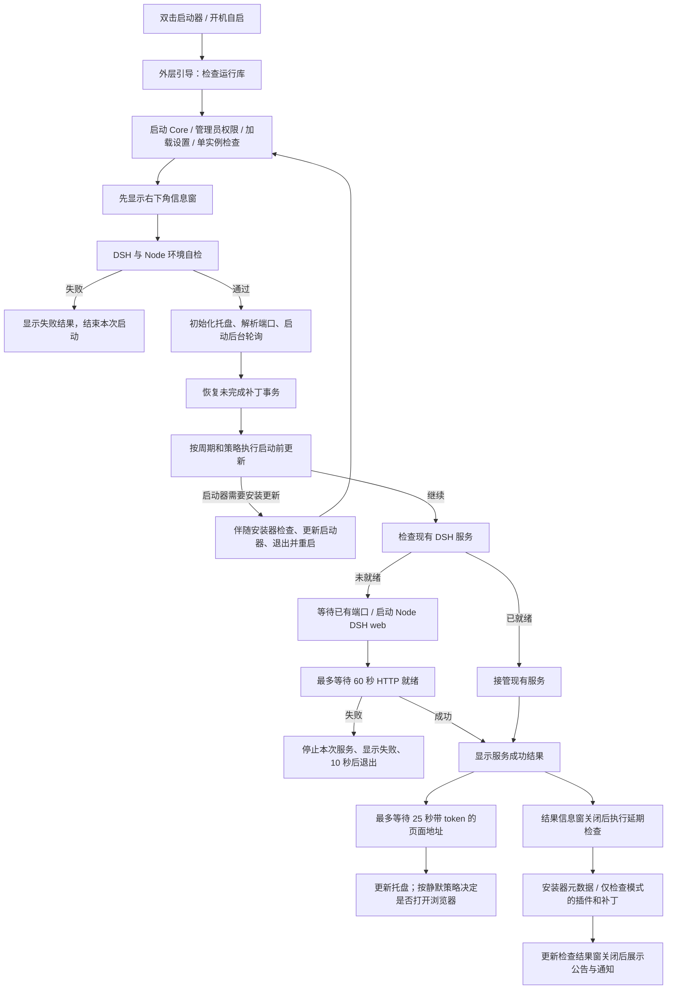

# 1.7.0 启动流程（修改前）

本文按仓库已提交的 `1.7.0` 实现还原，不包含正在开发的 `1.7.1` 安装器独立更新与导入功能。

## 总体顺序

## 1. 进程与环境

1. 外层 `DeepSeek Harness.exe` 检查 .NET 8 Desktop Runtime 和 Windows App Runtime 1.8；缺少时显示依赖错误，停止启动。
2. 外层把命令行参数传给 `DeepSeek Harness.Core.exe`。正常入口使用管理员权限；直接运行 Core 且未提权时会请求提权后重启。
3. Core 加载启动器设置，决定是否静默启动、不自动打开浏览器。
4. 检查单实例。已有实例时通知它打开页面，新实例直接退出。
5. 初始化 WinUI，先创建右下角信息窗，再检查 DSH 根目录、Node 与 DSH 入口文件。
6. 自检不通过时显示失败；通过后窗口切换为“检查更新”。

## 2. 初始化与并行任务

构造启动器运行上下文时会解析 DSH 端口：运行中的 DSH 进程、DSH 的 `last-url.txt`、常见端口及设置共同参与判断。随后建立托盘、日志与服务状态。

公告、通知、反馈回复轮询在这个阶段已开始，并不等 DSH 服务就绪。它们先把消息放进队列；实际展示仍受到更新与服务信息窗的占用限制。

开始主流程时恢复未完成的补丁事务，并启动余额定时器和服务监控。另有一个独立线程等待约 10 秒后写补丁健康标记；它判断启动器仍存活，不是等待 DSH HTTP 就绪后再计时。

## 3. 启动前更新

整体受自动检查周期控制。未到周期或更新策略全部关闭时，记录跳过并继续启动服务。

| 顺序 | 项目 | 修改前的处理 |
| --- | --- | --- |
| 1 | 启动器 | 自动安装和仅检查都在服务启动前检查。发现新版且选择自动安装时，下载安装器伴随更新与启动器包，替换并重启启动器。DSH 服务不因启动器自身更新而被停止。 |
| 2 | 安装器 | 没有独立三档策略。只有启动器实际更新时会伴随替换；否则延期到服务就绪后读取元数据。 |
| 3 | DSH 本体 | 自动安装和仅检查都在服务启动前检查；自动安装时完成更新后再启动服务。 |
| 4 | 在线插件 | 自动安装在服务启动前执行；仅检查延期到服务就绪后；关闭则跳过。 |
| 5 | 补丁 | 自动安装在服务启动前执行；仅检查延期到服务就绪后；关闭则跳过。 |

启动前更新异常通常写日志后继续启动 DSH。只有启动器已经进入替换/重启路径时，本实例不会再启动服务。

源码存在 `ShouldStartServiceImmediately()`，但当前 `Start()` 没有调用它。实际总是进入更新线程，再由更新线程收尾启动服务；不能把这个未使用的函数当作已经生效的快速启动路径。

## 4. DSH 服务与页面

1. 先做 HTTP 就绪检查。已在运行时直接接管，不创建第二个 Node 进程。
2. 端口已监听但 HTTP 未就绪时，先等待现有服务，最多约 60 秒。
3. 仍未就绪时尝试创建服务进程：`node <DSH入口> web --port <端口> --no-open`，工作目录为当前 DSH 根目录，`DSH_HOME=<当前DSH根目录>/.dsh`。
4. 对本次启动的进程再次等待 HTTP 就绪，最多约 60 秒，每 500 ms 检查一次。进程提前退出时立即报失败。
5. 成功后先显示服务成功结果，并设置服务已运行，再等待带 `token` 的页面地址，最多 25 秒，每 250 ms 读取一次。
6. 获取到地址后，非静默启动约延迟 1.2 秒打开浏览器。静默模式不打开；未拿到 token 地址也不打开，避免打开一个返回 401 的页面。
7. 失败时显示信息窗、更新失败托盘状态，约 10 秒后退出启动器。

## 5. 服务就绪后的检查与消息

延期检查等待服务已运行、启动/更新不忙、当前共享信息窗已经关闭，才显示新的更新检查窗并执行安装器元数据、插件和补丁的延期检查。

公告/通知调度器每 500 ms 尝试展示。启动中、更新中或者共享信息窗未关闭时，消息继续等待。

修改前的消息顺序为：后端离线/恢复提示，然后公告，再通知。公告窗口需要用户操作才能关闭，因此有未读公告的客户端可能一直排不到通知；本机已经读完公告时则可以直接看到通知。收到人数只说明消息已入队，不能说明窗口已经显示。

## 当前需要理顺的地方

- 启动前阶段同时承担“检查”和“安装”，启动器及 DSH 的仅检查也可能拖慢服务启动；插件和补丁的仅检查又放在服务之后，顺序不一致。
- 安装器只有元数据与伴随更新，缺少真正独立的检查、安装与结果状态。
- 公告/通知已经后台拉取，却要等多个窗口和未读公告让位，用户观察到的展示顺序不等于网络请求顺序。
- 服务 HTTP 已就绪后仍可能再等待 25 秒 token 地址，托盘完整更新与自动开网页被放在这个等待之后。
- 补丁“存活 10 秒”的健康标记和“DSH 服务可用”是两种不同条件。

关键实现：`source/RuntimeBootstrap.cs`、`source/WinUIProgram.cs` 的 `Main` / `OnApplicationLaunched` / `LauncherContext.Start` / `RunConfiguredUpdates` / `StartupThreadProc` / `FinishSuccessfulStartup` / `TryShowNextNotice`。
