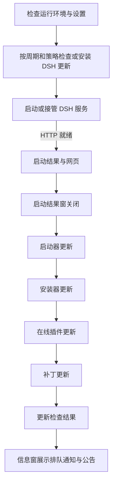

# 1.7.1 启动流程

1. 引导程序检查 .NET 8 Desktop Runtime 和 Windows App Runtime 1.8，启动 Core。
2. Core 加载设置、检查单实例与 DSH / Node 环境，初始化托盘及后台通知轮询。
3. 自动检查周期到期时，按 DSH 的策略执行本体更新。自动安装完成后才启动服务；仅检查只读取本体版本；关闭则跳过。
4. 启动或接管 DSH，等待 HTTP 就绪，显示启动结果。按启动设置打开带 Token 的网页。
5. 服务运行、启动阶段结束、当前更新结束且启动结果信息窗关闭后，依次执行启动器、安装器、在线插件和补丁更新。四项各自遵守自动安装、仅检查与关闭策略。
6. 后台更新收尾后显示检查结果，信息窗空闲时投递本地通知、普通通知和公告。

自动检查周期在整组更新实际完成后才记录。若服务启动失败，或启动器自更新中途重启，尚未完成的检查会在下次启动继续，不会提前消耗三天、七天或一个月的检查周期。

启动器自更新只替换启动器并重启自身，保留已有 DSH 进程；新的启动器会接管它。安装器独立替换安装器与卸载器，不重启 DSH。插件更新在服务已启动后进行，完成时提供重启 DSH 与稍后两个选项。

其他更新失败不阻止已经运行的 DSH；退出启动器或进入自更新交接时会取消尚未开始的后台阶段。启动器与其他更新使用同一信息窗，通知继续排队，普通通知可让未读公告暂时让位。

数据导入导出取得独占操作状态，要求服务已停止、端口未占用且相关更新已结束。传输期间启动器的服务启动、重启及 DSH / 插件更新不能同时开始。

这是正常的 1.7.1 程序更新，走启动器自更新；没有新增高危补丁条目或高危补丁确认。
